# Olist 巴西电商经营分析：物流履约 × 商品市场

> 基于 Olist 巴西电商公开数据集（约 9.5 万订单、27 州、9 张表）的经营质量诊断：
> **一个数据集、一套方法论、两个分析方向**——物流侧回答"货怎么送到"，商品侧回答"货怎么卖"。
> 工具链：Python (pandas / scikit-learn) · Power BI · SQL

## 一、项目概览

本项目从两个方向分析平台的经营表现：配送能否兑现承诺、商品能否卖对市场。同一份订单数据、同一套诊断方法。

| | 方向一：物流履约（供应链侧） | 方向二：商品市场（经营侧） |
|---|---|---|
| 回答的问题 | 延迟从哪来、该怎么治 | 卖什么、卖多少钱、在哪卖 |
| 分析单位 | 订单 → 线路（37 条主要线路） | 订单 → 商品行（110,197 件） |
| 核心产出 | 承诺校准方案 + 前置仓选址 | 品类结构 + 价格带 + 区域市场分层 |
| 服务决策 | 物流 / 供应链 | GTM / 商品 / 市场 |

**两个方向不是两份独立分析**：共用同一底座口径（delivered 订单、订单平均评分、差评=均分≤2、件数口径、分箱逻辑一致），共用同一套方法（异常定位 → 根因量化 → 方案验证），并在结论上互相印证——

> **里约热内卢（RJ）在两个方向上同时异常**：物流方向，圣保罗→里约是最大异常线路（延迟率 14.25%，超额延迟贡献 62,398，断层第一）；商品方向，里约买家的全品类差评率 20.81%，27 州中最差。

## 二、核心发现（数字钉实）

**方向一：物流履约**

| 发现 | 数据 |
|---|---|
| 最大异常线路 | **SP→RJ**（圣保罗→里约，8,021 单） |
| 该线延迟率 | **14.25%**，是同距离档（200-500km）正常水平 6.47% 的 **2.2 倍** |
| 超额延迟贡献 | **62,398**，为第二名的 **8.5 倍**（断层第一） |
| 距离是否背锅 | 官方公路仅 **429km**——问题不在距离，在配送执行 |
| 承诺错配 | 里约现状承诺 26 天、实际需要 37 天，**缺 11 天** |
| 方案效果 | 校准后订单数 ≥500 的 27 条线路延迟率全部压到 **6.4% 以内**（SPRJ 14.25%→5.98%） |
| 归因结论 | 随机森林：延迟天数权重 **0.883**、承诺天数 0.117——**延迟是差评的第一驱动** |

**方向二：商品市场**

| 发现 | 数据 |
|---|---|
| 品类口碑差 | 74 个品类，件数加权差评率 **14.73%**，均分 4.08 |
| 问题品类（量大且口碑差） | 床品家纺 10,831 件 / 差评率 **18.08%**；家具装饰 17.97%；电脑配件 17.00% |
| 机会品类（量大且口碑好） | 美妆健康 9,402 件 / 差评率 **12.45%** |
| 主力价格档 | **50-100 元**（32,492 件，占 29.5%），差评率 15.18% |
| 价格与口碑 | 价格对口碑影响弱（各档 14.2%~16.2%）——**问题不在价格带，在商品与履约质量** |
| 区域市场分层 | 圣保罗 46,448 件 / 差评率 **12.40%**（全国最好）；里约 14,143 件 / **20.81%**（全国最差）；巴伊亚 18.83% |
| 品类 × 履约联合 | 差评率 14.73% 里 **3.33 个百分点（22.6%）与延迟同现**；品类口碑差距主要来自品类自身（准时组差评率 6.4%~22.3%） |
| 物流杠杆最大的品类 | 文具 **32.4%**、美妆健康 **32.1%**、玩具 29.6% 的差评与延迟同现；办公家具只有 12.6%（品类自身问题） |

## 三、方向一：物流履约（`logistics/`）

**问题**：延迟率随距离上升是常识，但巴西平台的延迟集中在少数线路——这些线路的延迟是距离造成的，还是执行造成的？

**方法**：构建"订单 → 线路"两级分析框架（37 条主要线路），用距离分档建立基准线，识别超额延迟线路；把"超额延迟贡献 = 订单数 ×（线路延迟率 − 同档基准）"作为问题优先级排序依据；再用随机森林做差评归因，最后验证承诺校准方案。

**关键过程**：距离分档基准 0-200km 4.59% → 2000km+ 12.13%；跨州 8.13% vs 州内 4.55%（1.8 倍）；但 SPRJ 在 383km 档上出现 14.25% 的极端离群（同档仅 6.47%）——离群点定位后，误差来源被锁定为承诺天数与实际所需天数的错配。

**产出**：
- `logistics/报告_物流履约.md` 分析报告全文
- `方法与口径.md`（仓库根）全项目口径决策、方向差异说明与高频问答
- `logistics/data/` 37 条主要线路结果表、距离分档、州内跨州
- `logistics/图表/` 10 张图（6 张分析图 + 4 张 Power BI 看板截图）

## 四、方向二：商品市场（`market/`）

**问题**：平台卖什么品类口碑好、什么品类在拖后腿？价格带与口碑有没有关系？哪些市场值得投入、哪些需要治理？

**方法**：以商品行为分析单位（一单多品类则分别计入各品类），把订单评分聚合到商品行；三个模块分别回答结构（品类）、定价（价格带）、区域（州 × 品类）三个问题；价格带边界用分布拐点 + 业务整数（0/20/50/100/200）确定，并用第二套边界（0/30/60/120/240）做敏感性检验。

**关键过程**：品类件数加权差评率 14.73%，其中床品家纺（18.08%）、家具装饰（17.97%）为问题品类，美妆健康（12.45%）为机会品类；价格带主力档 50-100 元占 29.5%，口碑最好档 100-200 元（14.17%），价格对口碑影响弱，说明口碑主要受品类属性与履约影响；区域上圣保罗最好（12.40%）、里约最差（20.81%）——与物流方向的里约异常互为证据。

**产出**：
- `market/报告_商品市场.md` 分析报告全文
- `market/analysis.py` 数据层（底座 + 品类 + 价格带 + 区域聚合 + 品类 × 履约联合）
- `market/charts.py` 展现层（品类 × 履约联合 2 张 + 整页汇总 1 张）
- `market/品类履约联合_交互看板.html` 单文件交互看板（零依赖、离线可用、双击即开）
- `market/data/` 品类结构、价格带、区域画像、区域品类、品类履约联合结果表
- `market/图表/` 7 张图 + 1 张 Power BI 看板页截图（`看板_品类履约.png`）

**延伸：品类 × 履约（`analysis.py` 模块④ + `charts.py`）**——把方向一的订单级延迟标记接到本方向的商品行上，回答"口碑差的品类，是配送慢连累的，还是品类自身的问题"：平台层延迟贡献 **3.33 个百分点（占差评 22.6%）**，品类层在 12.6%~32.4% 之间，结论见 `报告_商品市场.md` 5.2，口径见根目录 `方法与口径.md` 3.7。

## 五、图表

### 方向一：物流履约（`logistics/图表/`）

| 延迟与差评 | 距离与延迟 |
|:--:|:--:|
| 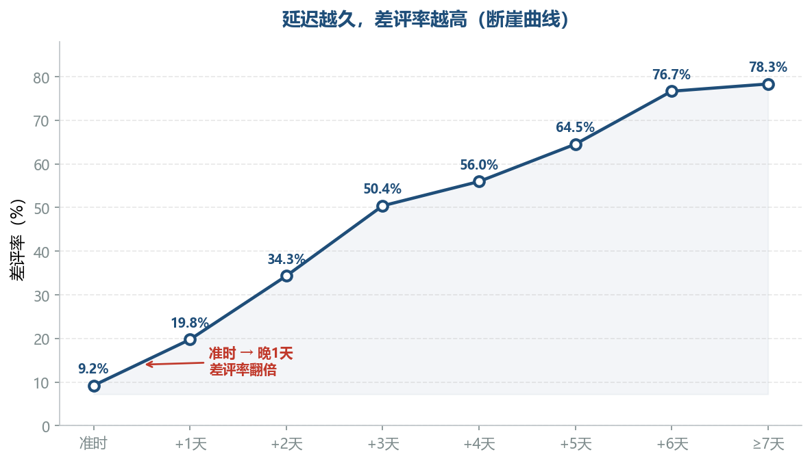 |  |

| 州内 vs 跨州 | 前置仓选址 | 随机森林归因 | 承诺错配 |
|:--:|:--:|:--:|:--:|
|  | 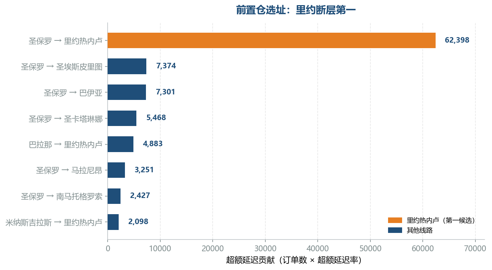 |  | 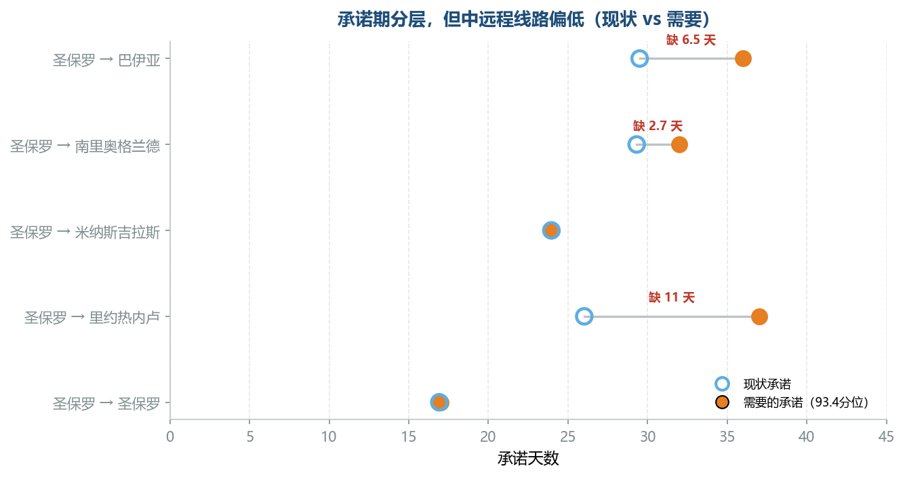 |

**Power BI 看板截图**（同属方向一，07-10）

| 订单结构 | 超额延迟贡献 | 承诺校准效果 | 里约异常 |
|:--:|:--:|:--:|:--:|
| 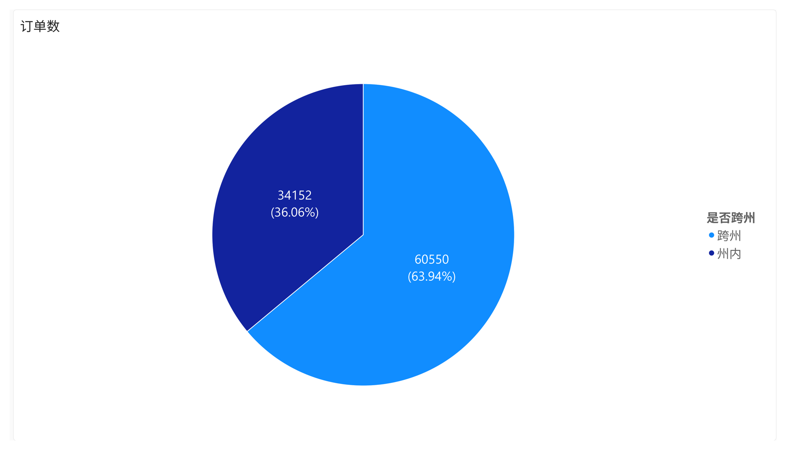 | 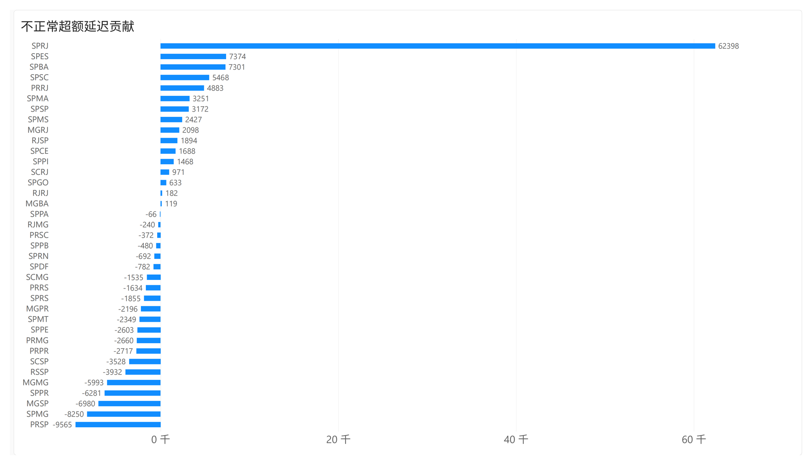 | 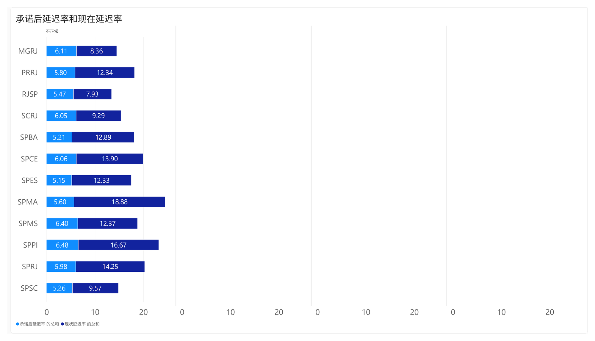 | 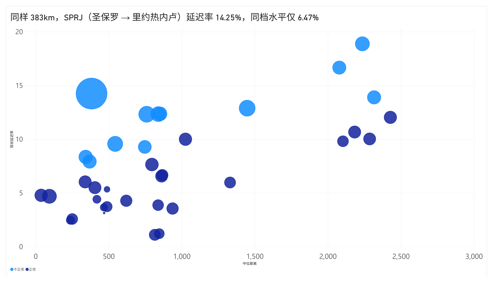 |

### 方向二：商品市场（`market/图表/`）

| 品类定位 | 价格带结构 |
|:--:|:--:|
| 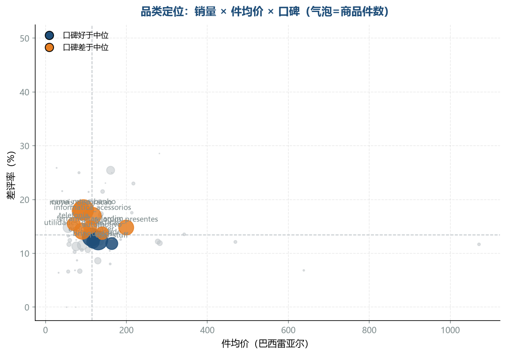 | 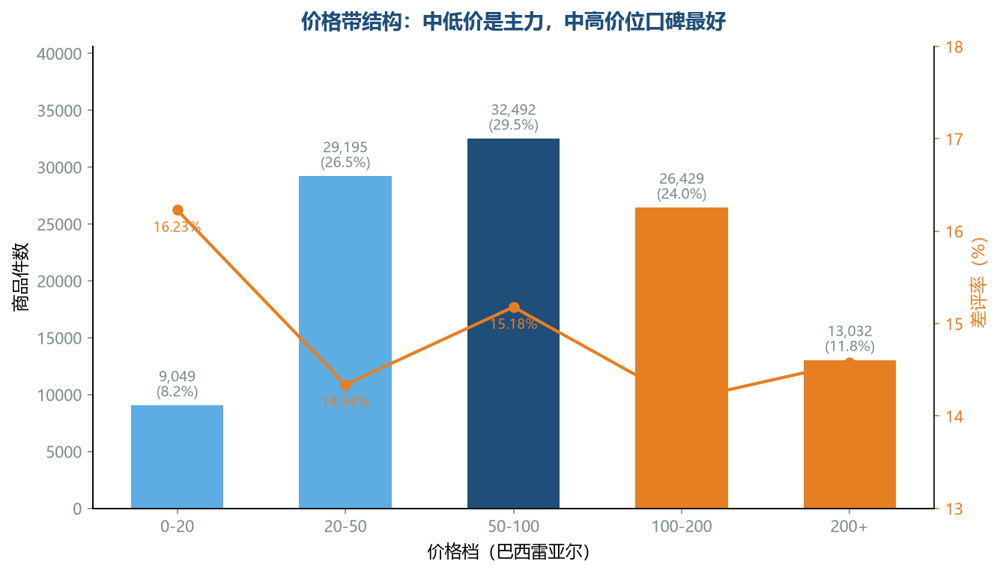 |

| 区域市场 | 区域品类偏好 |
|:--:|:--:|
| 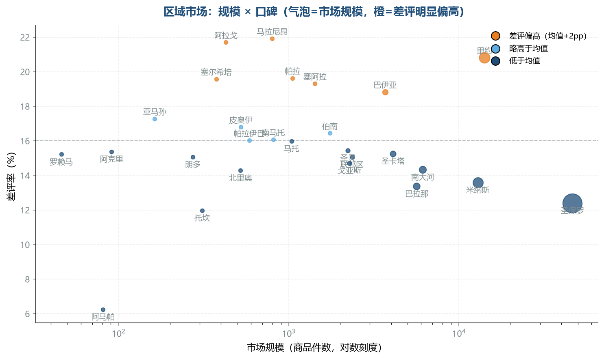 | 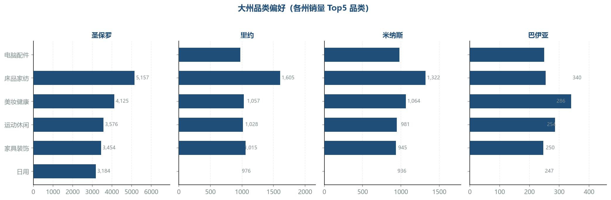 |

**品类 × 履约联合**（`analysis.py` 模块④）

整页汇总（Python 制图）：

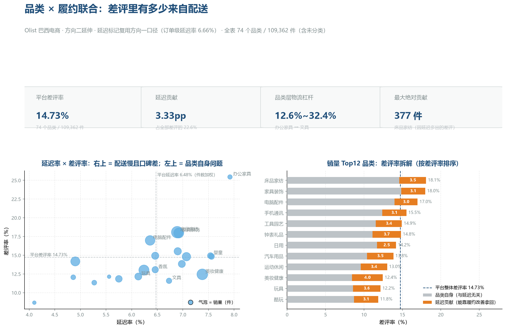

| 延迟率 × 差评率 四象限 | 差评率拆解 |
|:--:|:--:|
| 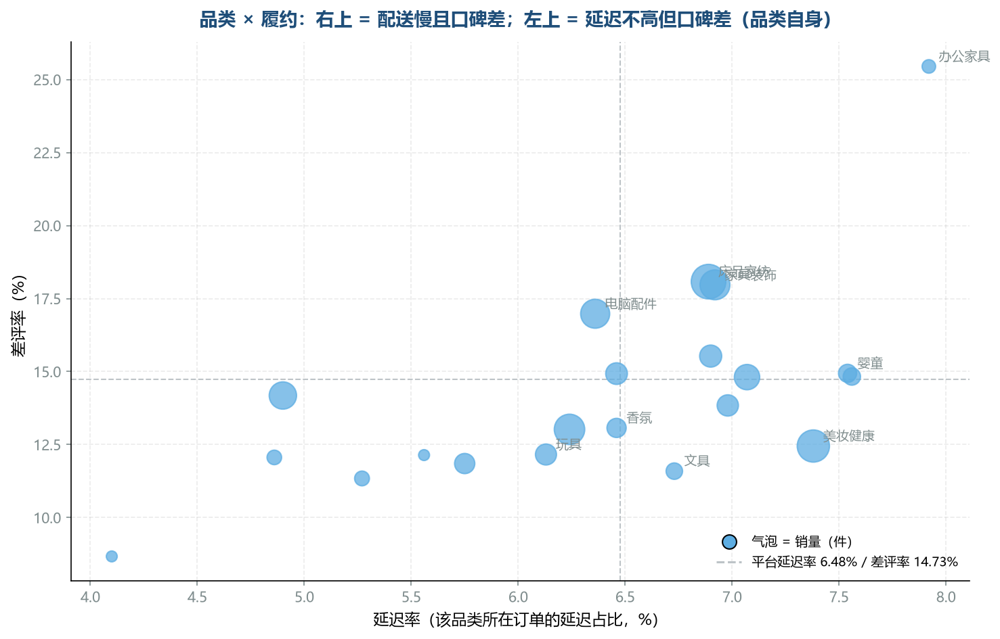 | 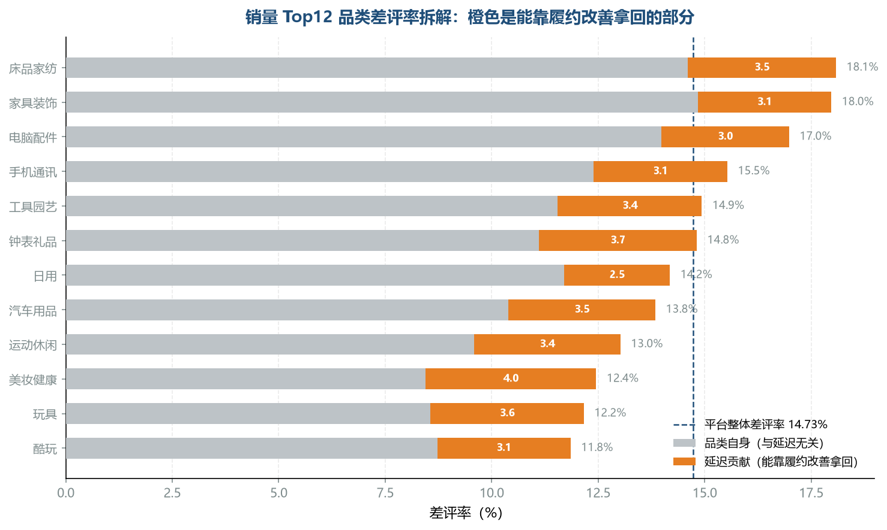 |

**交互版**：[market/品类履约联合_交互看板.html](market/品类履约联合_交互看板.html)——单文件、零依赖，下载后双击即开（悬停看数值、点品类高亮、表头排序、销量门槛与搜索过滤）。**已开 GitHub Pages，在线直接打开**：[交互看板](https://lyfbtk.github.io/Analysis/market/品类履约联合_交互看板.html)｜[本 README 的网页版](https://lyfbtk.github.io/Analysis/)。

**Power BI 交互版**（源文件 `123.pbix` 第 7 页"品类×履约"，数据源为同一份结果表）：切片器筛选品类 → 散点、堆积条、表格三处联动。

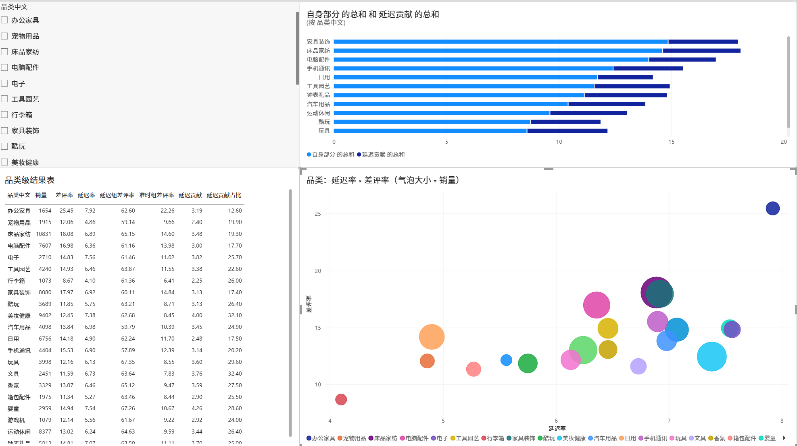

> 看板用 Power BI Desktop 制作，页面截图见上方 07-10；与 Python 结果互验的 SQL 查询见 [logistics/olist数据.sql](logistics/olist数据.sql)（口径说明 [logistics/sql代码说明.md](logistics/sql代码说明.md)）。
> `logistics/图表/` 的图为分析结果导出（Python 制图 + Power BI 看板），生成脚本不在仓库；`market/图表/` 的 7 张图由 [market/charts.py](market/charts.py) 生成（含品类 × 履约联合 2 张与整页汇总 1 张），可重跑复现。

## 六、目录结构

```
.
├─ README.md
├─ 方法与口径.md                 全项目口径决策、方向差异与高频问答
├─ requirements.txt
├─ data/
│   └─ raw/                      Olist 原始数据（9 个 CSV，需自行下载，见运行说明）
├─ logistics/                    方向一：物流履约
│   ├─ analysis.py               主分析脚本（pandas / sklearn）
│   ├─ 报告_物流履约.md
│   ├─ olist数据.sql             与 Python 结果互验的 SQL 查询
│   ├─ sql代码说明.md
│   ├─ data/                     分线路统计、距离档、州内跨州
│   └─ 图表/                     6 张分析图 + 4 张看板截图
├─ market/                       方向二：商品市场
│   ├─ analysis.py               数据层（底座 + 三模块 + 品类 × 履约联合）
│   ├─ charts.py                 展现层（7 张图 + 交互看板 HTML）
│   ├─ 品类履约联合_交互看板.html  单文件交互看板（charts.py 生成）
│   ├─ 报告_商品市场.md
│   ├─ data/                     品类结构、价格带、区域画像、区域品类、品类履约联合
│   └─ 图表/                     7 张图（含联合分析 2 张 + 整页汇总 1 张）+ 1 张 Power BI 看板截图
```

## 七、数据来源

Olist Brazilian E-Commerce Public Dataset，公开于 Kaggle：
https://www.kaggle.com/datasets/olistbr/brazilian-ecommerce

## 八、运行说明（复现路径）

```bash
# 1. 从 Kaggle 下载 Olist 数据集，解压后把 9 个 CSV 放进 data/raw/
# 2. 安装依赖
pip install -r requirements.txt

# 3. 方向一：物流履约
python logistics/analysis.py
#    输出：logistics/data/分线路统计.csv、距离档.csv、州内跨州.csv

# 4. 方向二：商品市场
python market/analysis.py
python market/charts.py
#    输出：market/data/ 5 张结果表（品类结构/价格带/区域画像/区域品类/品类履约联合）
#         + market/图表/ 7 张图 + 交互看板 HTML + Power BI 导入表（品类履约联合_PowerBI.csv）

# 5. 看板：用 Power BI Desktop 导入 logistics/data/ 与 market/data/ 的结果表搭建
#    物流 6 页截图见 logistics/图表/07-10；品类×履约页见 market/图表/看板_品类履约.png（源文件 123.pbix）
```

> 仓库内 `logistics/data/`、`market/data/` 已含运行结果，不跑代码也可直接查看。
> Mac/Linux 若图内中文显示为方块，安装 Noto Sans CJK 字体即可（Windows 自带微软雅黑，无需处理）。

## 九、技术栈

- **Python**：pandas 数据清洗与聚合、scikit-learn 随机森林（特征重要性归因）、分箱与敏感性检验、matplotlib 制图（代码使用中文列名与中文业务场景一致）
- **Power BI**：7 页交互看板（物流 6 页：问题严重度 / 延迟规律与里约反例 / 方案效果等；品类×履约 1 页：切片器联动 + 交叉筛选）
- **SQL**：Olist 数据查询与口径验证（差评率分组统计、延迟率多口径交叉核对，与 Python 结果相互验证）

## 十、AI 使用说明

本项目从分析设计到数字对账，全程以 AI 辅助完成，角色分工如实说明：

- **问题定义、指标口径、统计方法、分析决策由本人完成**；分析脚本由本人在 AI 辅助下编写（AI 提供任务拆解与报错排查）
- **本地 Agent 工具链**：自建 Agent 工作流（本地部署，Windows 环境）——代码与脚本自动执行、终端/文件/搜索多工具调用、按任务复杂度路由模型（日常任务用轻量模型控制成本，深度任务用推理模型）
- **所有关键数字经"AI 提案 → 数据重算 → 多模型交叉复核"流程**：使用 DeepSeek/Gemini/GLM 多个模型交叉审查文档与统计口径，AI 输出的结论必须通过样本重算才被采纳——项目中曾否决一个未经数据验证的分位数口径
- 仓库中每个引用数字均可由 `logistics/analysis.py`、`market/analysis.py` + `data/` 结果复现；如果对任何数字有疑问，可以随时用代码验证

> 这份说明的目的不是免责，而是展示一种工作方式：**AI 提效的同时，所有结论对数据负责。**
