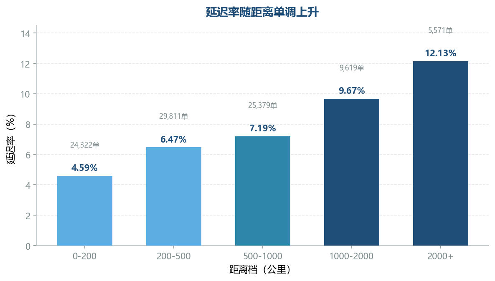
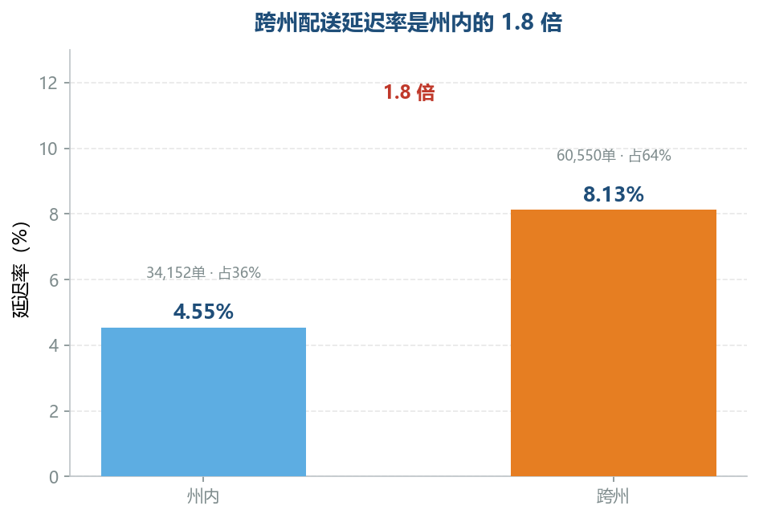
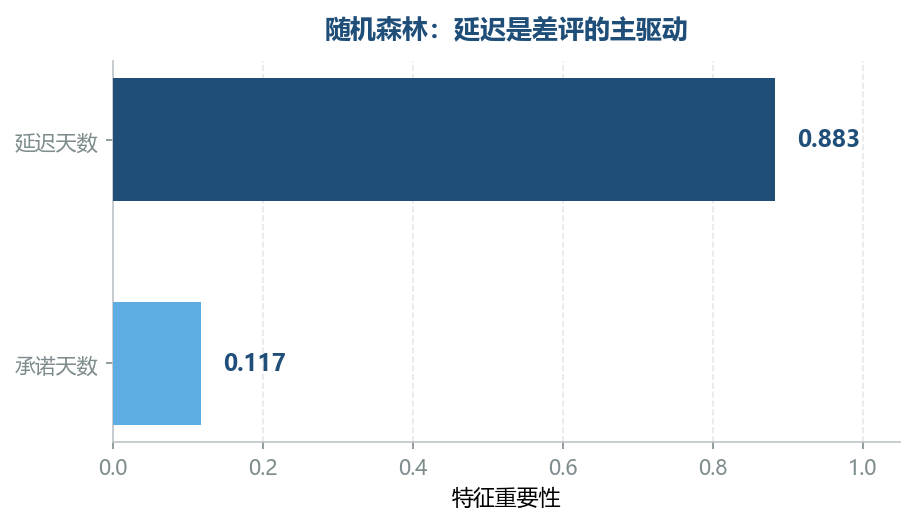

# Olist 巴西电商物流延迟分析与优化

> 基于 Olist 公开数据集（巴西电商、约 9.5 万订单、27 州）的物流延迟成因分析与优化方案。
> 工具链：Python (pandas/scikit-learn) · Power BI · SQL

## 一句话结论

**物流延迟的主因是"配送承诺与配送能力错配"，而非单纯的距离。** 通过承诺校准 + 前置仓选址，SPRJ 延迟率从 14.25% 压到 5.98%，订单数不少于 500 单的线路全部压到 6.4% 以内。

## 核心发现（数字钉实）

| 发现 | 数据 |
|---|---|
| 定位最大异常线路 | **SP→RJ 线**（圣保罗→里约热内卢，8,021 单） |
| 该线延迟率 | **14.25%**，是同距离档（200-500km）正常水平 **6.47%** 的 **2.2 倍** |
| 超额延迟贡献 | **62,398**，为第二名的 **8.5 倍**（断层第一） |
| 距离是否背锅 | 官方公路仅 **429km**，不远——**问题不在距离，在配送执行** |
| 承诺错配 | 里约现状承诺 26 天，实际需要 37 天，**缺 11 天** |
| 方案效果 | 校准后订单数≥500 单的 27 条线路延迟率全部压到 **6.4% 以内**（SPRJ 14.25%→5.98%）；仅 3 条 300-499 单小线路略超（最高 6.69%） |
| 特征重要性 | 随机森林：延迟天数权重 0.883、承诺天数 0.117 |

## 图表

| 问题严重度 | 距离剂量反应 |
|:--:|:--:|
|  |  |

| 州内/跨州 | 前置仓选址 | 特征重要性 | 承诺错配 |
|:--:|:--:|:--:|:--:|
|  |  |  |  |

> 完整交互看板见 [看板/olist.pdf](看板/olist.pdf)（Power BI 导出，586KB），源文件 [看板/成品.pbit](看板/成品.pbit)。

## 目录结构

```
.
├─ 项目报告.md          分析报告全文
├─ 深度推演.md          方法、口径决策、踩坑记录
├─ code/analysis.py    主分析脚本（pandas/sklearn）
├─ data/                37 条线路结果表、距离档、州内跨州
├─ 图表/                6 张分析图
└─ 看板/                Power BI 看板（PDF + pbit + SQL）
```

## 数据来源

Olist Brazilian E-Commerce Public Dataset，公开于 Kaggle：
https://www.kaggle.com/datasets/olistbr/brazilian-ecommerce

## 运行说明（复现路径）

1. 从 [Kaggle](https://www.kaggle.com/datasets/olistbr/brazilian-ecommerce) 下载 Olist 数据集，解压后放入 `data/raw/` 目录
2. `pip install -r requirements.txt`
3. `python code/analysis.py`
4. 输出：`data/分线路统计.csv`、`data/距离档.csv`、`data/州内跨州.csv`
5. 看板：Power BI 导入以上 CSV，源文件见 `看板/成品.pbit`（导出版 `看板/olist.pdf`）

> 仓库内 `data/` 目录已含一份运行结果（37 条主要线路），不跑代码也可直接查看。

## 技术栈

- **Python**：pandas 数据清洗与聚合、scikit-learn 随机森林（特征重要性）、自建"订单—线路"两级分析框架（代码使用中文列名，与中文业务分析场景一致）
- **Power BI**：3 页交互看板（问题严重度 / 延迟规律与里约反例 / 方案效果）
- **SQL**：Olist 数据查询与口径验证（差评率分组统计、延迟率多口径交叉核对，与 Python 结果相互验证）
